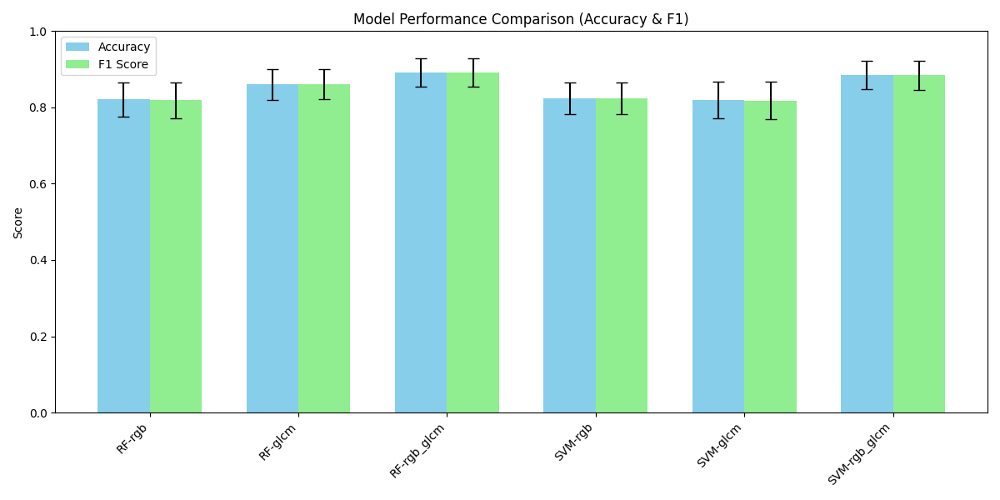
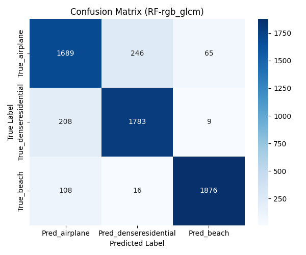
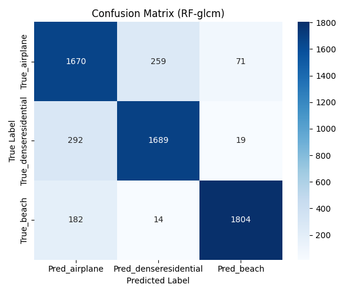
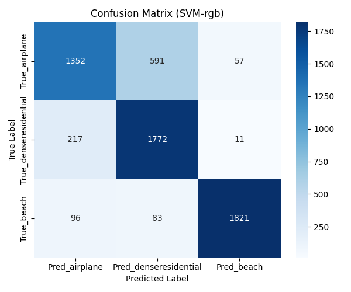
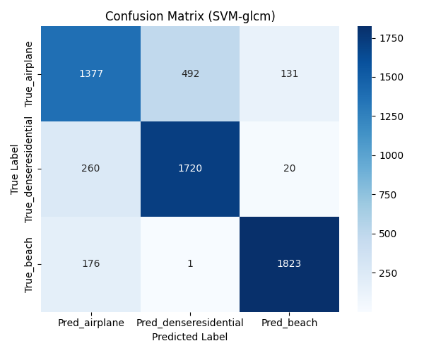
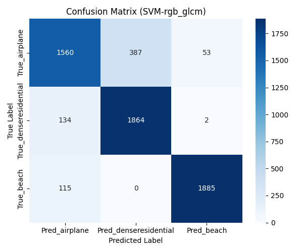
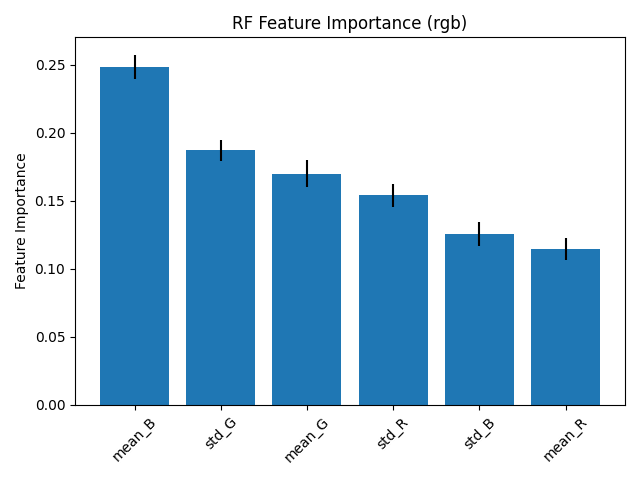
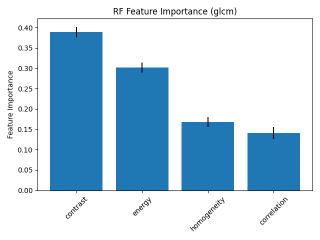
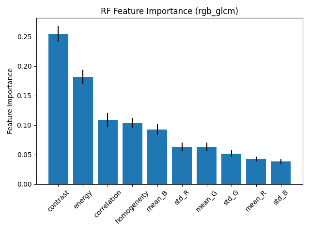

# Machine Learning Portfolio: Aircraft Image Classification Experiment

## Background and Motivation

Machine learning is an essential tool for analyzing and quantifying human motion and sensory data.
To gain practical experience with the full machine learning workflow, this project implements the entire pipeline from data preprocessing to model evaluation.

The objective of this experiment was to implement the complete workflow independently and to compare model performance under different feature configurations.

---

## Class Selection Strategy

The following three classes were intentionally selected.

* **beach**
  Uniform sand and water colors → expected to be distinguishable using RGB statistics.

* **denseresidential**
  Regular building patterns → expected to be distinguishable using texture features such as GLCM.

* **airplane**
  Airport scenes contain large concrete areas and structural patterns,
  which may resemble both beach and residential textures.
  This class was selected as a challenging category that may require
  both color and texture features for accurate classification.

By combining these classes, the experiment was designed to evaluate how color features (RGB) and texture features (GLCM) influence classification performance.

---

## Technologies

Python libraries used:

* Python
* Pandas
* NumPy
* scikit-learn
* scikit-image
* Pillow
* matplotlib

Models used:

* Support Vector Machine (RBF kernel)
* Random Forest

Evaluation method:

Stratified 5-fold Cross Validation repeated **20 times**.

This repeated evaluation was used to reduce the effect of randomness and obtain more stable performance estimates.

---

## Features

The following feature sets were used.

RGB statistical features:

* Mean and standard deviation for each channel

GLCM texture features:

* contrast
* energy
* homogeneity
* correlation

Three feature configurations were compared:

* RGB only
* GLCM only
* RGB + GLCM

---

## Results

### Accuracy / F1-score Comparison



The combination of RGB and GLCM features achieved the highest Accuracy and F1-score for both models.

For Random Forest, GLCM features alone outperformed RGB features.
For SVM, the difference between RGB and GLCM was relatively small.

---

### Confusion Matrices

| RF-RGB                                  | RF-RGB_GLCM                                  |
| --------------------------------------- | -------------------------------------------- |
|  |  |

| RF-GLCM                                  | SVM-RGB                                  |
| ---------------------------------------- | ---------------------------------------- |
|  |  |

| SVM-GLCM                                  | SVM-RGB_GLCM                                  |
| ----------------------------------------- | --------------------------------------------- |
|  |  |

---

### Feature Importance (Random Forest)

| RGB                                | GLCM                                | RGB_GLCM                                |
| ---------------------------------- | ----------------------------------- | --------------------------------------- |
|  |  |  |

---

## Discussion

Combining RGB and GLCM significantly reduced misclassification between **airplane** and **denseresidential**.
Texture information such as structural patterns and brightness variations around airport areas likely contributed to this improvement.

However, misclassification from **beach → airplane** slightly increased after adding GLCM features.
This result was contrary to the initial expectation.

One possible explanation is that the relatively uniform texture of sand was interpreted as similar to the flat concrete surface of airport areas.
While RGB features clearly separated beach images, adding GLCM features may have caused them to appear more similar to airplane scenes.

Feature importance analysis indicates that **contrast** and **energy** contributed most strongly to classification, suggesting that texture roughness and uniformity were important cues for classification.

Possible improvements include:

* adding local shape features such as HOG
* using multi-directional GLCM
* performing systematic hyperparameter tuning

---

## Environment

Python libraries required to run the project:

```
pip install -r requirements.txt
```

---

## Additional Materials

Experimental report (PDF):

* 馬淵健_Pythonを用いた画像処理・機械学習経験.pdf

Source code:

* MachineLearning_multiple5K.py
